# Architecture Documentation

## Table of Contents
1. [High-Level Overview](#high-level-overview)
2. [System Architecture](#system-architecture)
3. [Core Components](#core-components)
4. [Data Flow](#data-flow)
5. [Agent System](#agent-system)
6. [MCP Integration](#mcp-integration)
7. [REMME System](#remme-system)
8. [Execution Model](#execution-model)
9. [Memory & Context Management](#memory--context-management)
10. [API Layer](#api-layer)
11. [Metrics & Analytics](#metrics--analytics)
12. [UI & Visualization](#ui--visualization)

---

## High-Level Overview

The S16 NetworkX Agent System is a **graph-based multi-agent orchestration framework** that uses NetworkX directed acyclic graphs (DAGs) to coordinate specialized AI agents. The system processes complex queries by:

1. **Planning**: Breaking down queries into a dependency graph of tasks
2. **Execution**: Running agents in parallel when dependencies allow
3. **Coordination**: Managing data flow between agents via a shared context
4. **Tool Integration**: Providing agents access to external tools via MCP (Model Context Protocol) servers

### Key Design Principles

- **Graph-First Architecture**: All execution state is stored in NetworkX graphs
- **Dependency-Driven Execution**: Agents execute only when dependencies are satisfied
- **ReAct Pattern**: Agents use reasoning-action loops for tool calling
- **Modular Agents**: Each agent is specialized with its own prompt and tool access
- **Async Execution**: Full async/await support for concurrent agent execution
- **REMME Integration**: Centralized user memory and preference system that personalizes agent behavior

---

## System Architecture

### Architecture Diagram

```mermaid
graph TB
    subgraph "Entry Point"
        APP[app.py<br/>CLI/Web UI]
    end
    
    subgraph "Core Orchestration"
        LOOP[AgentLoop4<br/>Main Orchestrator]
        RUNNER[AgentRunner<br/>Agent Executor]
        CONTEXT[ExecutionContextManager<br/>State Management]
    end
    
    subgraph "Agent Layer"
        PLANNER[PlannerAgent]
        BROWSER[BrowserAgent]
        CODER[CoderAgent]
        RETRIEVER[RetrieverAgent]
        SUMMARIZER[SummarizerAgent]
        DISTILLER[DistillerAgent]
        THINKER[ThinkerAgent]
        FORMATTER[FormatterAgent]
        CLARIFY[ClarificationAgent]
        QA[QAAgent]
    end
    
    subgraph "MCP Servers"
        MCP_MGR[MultiMCP<br/>Server Manager]
        MCP_BROWSER[Browser Server]
        MCP_RAG[RAG Server]
        MCP_SANDBOX[Sandbox Server]
    end
    
    subgraph "LLM Layer"
        MODEL_MGR[ModelManager<br/>Gemini/Ollama]
    end
    
    subgraph "REMME System"
        REMME_STORE[RemmeStore<br/>FAISS Vector Store]
        REMME_EXTRACT[RemmeExtractor<br/>LLM Extraction]
        REMME_HUBS[Preference Hubs<br/>Structured Storage]
        REMME_NORM[Normalizer<br/>Schema Mapping]
    end
    
    subgraph "Storage"
        GRAPH[NetworkX Graph<br/>Execution State]
        SESSIONS[Session Logs<br/>JSON Files]
        REMME_INDEX[REMME Index<br/>Memories & Hubs]
    end
    
    subgraph "API Layer"
        API[FastAPI Server<br/>REST Endpoints]
        ROUTERS[API Routers<br/>Runs/REMME/Metrics]
    end
    
    APP --> LOOP
    APP --> API
    API --> ROUTERS
    LOOP --> RUNNER
    LOOP --> CONTEXT
    RUNNER --> PLANNER
    RUNNER --> BROWSER
    RUNNER --> CODER
    RUNNER --> RETRIEVER
    RUNNER --> SUMMARIZER
    RUNNER --> DISTILLER
    RUNNER --> THINKER
    RUNNER --> FORMATTER
    RUNNER --> CLARIFY
    RUNNER --> QA
    
    RUNNER --> MODEL_MGR
    RUNNER --> MCP_MGR
    RUNNER --> REMME_HUBS
    
    MCP_MGR --> MCP_BROWSER
    MCP_MGR --> MCP_RAG
    MCP_MGR --> MCP_SANDBOX
    
    CONTEXT --> GRAPH
    CONTEXT --> SESSIONS
    CONTEXT --> REMME_STORE
    
    REMME_EXTRACT --> REMME_STORE
    REMME_EXTRACT --> REMME_HUBS
    REMME_NORM --> REMME_HUBS
    REMME_STORE --> REMME_INDEX
    REMME_HUBS --> REMME_INDEX
    
    BROWSER --> MCP_BROWSER
    CODER --> MCP_SANDBOX
    RETRIEVER --> MCP_RAG
```

---

## Core Components

### 1. Application Entry Point (`app.py`)

**Purpose**: Main entry point supporting both CLI and Web UI modes.

**Key Responsibilities**:
- Initialize MCP servers
- Create `AgentLoop4` instance
- Handle user input (CLI or Gradio UI)
- Manage async event loop

**Key Functions**:
- `main()`: Entry point that starts MCP servers and initializes the agent loop
- `run_query()`: Helper function to execute queries and extract results

**Modes**:
- **CLI Mode**: Interactive terminal interface with Rich console
- **Web UI Mode**: Gradio-based chat interface with real-time log streaming

### 2. Agent Loop (`core/loop.py` - `AgentLoop4`)

**Purpose**: Main orchestration engine that manages the execution lifecycle.

**Execution Phases**:

```mermaid
sequenceDiagram
    participant User
    participant Loop as AgentLoop4
    participant Runner as AgentRunner
    participant Planner as PlannerAgent
    participant Context as ExecutionContextManager
    participant Agents as Other Agents
    
    User->>Loop: Query
    Loop->>Runner: Run DistillerAgent (if files)
    Runner-->>Loop: File Profiles
    Loop->>Runner: Run PlannerAgent
    Runner->>Planner: Generate Plan
    Planner-->>Runner: Plan Graph (DAG)
    Runner-->>Loop: Plan Graph
    Loop->>Context: Create ExecutionContext
    Note over Loop: Execute DAG
    loop For each ready step
        Loop->>Agents: Execute Agent
        Agents-->>Loop: Results
        Loop->>Context: Update State
    end
    Loop-->>User: Final Context
```

**Key Methods**:
- `run()`: Main execution method that orchestrates all phases
- `_execute_dag()`: Executes the DAG with visualization and dependency resolution
- `_execute_step()`: Executes a single agent step with ReAct loop support
- `_handle_failures()`: Handles mid-session replanning (TODO)

**ReAct Loop Implementation**:
- Each agent can make up to 15 turns
- Agents can call tools via `call_tool` in their output
- Tool results are fed back to the agent for next iteration
- Agents can use `call_self` for recursive execution

### 3. Agent Runner (`agents/base_agent.py` - `AgentRunner`)

**Purpose**: Executes individual agents by loading prompts, calling LLMs, and parsing responses.

**Agent Execution Flow**:

```mermaid
graph LR
    A[AgentRunner.run_agent] --> B[Load Config]
    B --> C[Load Prompt Template]
    C --> D[Get Tools from MCP]
    D --> E[Build Full Prompt]
    E --> F[Create ModelManager]
    F --> G[Generate LLM Response]
    G --> H[Parse JSON]
    H --> I[Calculate Cost]
    I --> J[Return Result]
```

**Key Responsibilities**:
- Load agent configuration from `agent_config.yaml`
- Load prompt templates from `prompts/` directory
- Retrieve available tools from specified MCP servers
- Build complete prompt with tools and input data
- Call LLM via `ModelManager`
- Parse JSON response using `json_parser`
- Calculate token usage and costs

**Configuration Structure**:
```yaml
AgentName:
  prompt_file: "path/to/prompt.md"
  model: "gemini"  # or "ollama"
  mcp_servers: ["browser", "rag"]  # Tools available to this agent
  description: "Agent description"
```

### 4. Execution Context Manager (`memory/context.py`)

**Purpose**: Manages execution state using NetworkX graphs as the single source of truth.

**Graph Structure**:

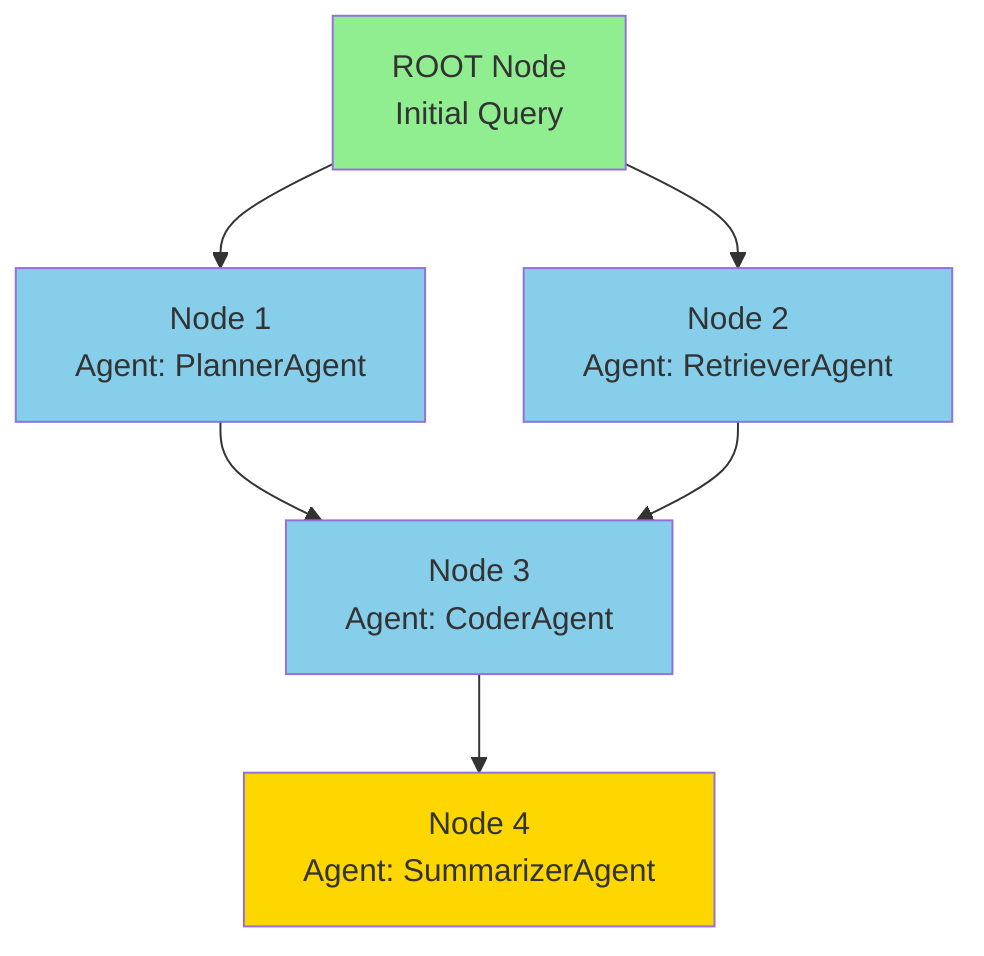

**Graph Attributes**:
- `session_id`: Unique session identifier
- `original_query`: User's original query
- `file_manifest`: List of uploaded files
- `created_at`: Timestamp
- `status`: Overall execution status
- `globals_schema`: Shared variable storage (key-value pairs)

**Node Attributes**:
- `agent`: Agent type (e.g., "PlannerAgent")
- `status`: "pending", "running", "completed", "failed"
- `description`: Human-readable task description
- `agent_prompt`: Specific prompt for this step
- `reads`: List of variable names this step reads
- `writes`: List of variable names this step writes
- `output`: Agent output
- `error`: Error message if failed
- `cost`, `input_tokens`, `output_tokens`: Cost tracking
- `start_time`, `end_time`, `execution_time`: Timing data

**Key Methods**:
- `get_ready_steps()`: Returns nodes whose dependencies are complete
- `mark_running()`: Marks a step as running
- `mark_done()`: Marks step complete, extracts outputs to `globals_schema`
- `mark_failed()`: Marks step as failed
- `get_inputs()`: Retrieves input data from `globals_schema` based on `reads`
- `all_done()`: Checks if all steps are complete
- `get_execution_summary()`: Generates summary with costs and outputs

**Data Extraction Logic**:
The `mark_done()` method uses multiple strategies to extract outputs:
1. **Code Execution Results**: Extract from `execution_result.result` (for CoderAgent, RetrieverAgent)
2. **Direct Output**: Extract from agent output dictionary root
3. **Nested Output**: Extract from `output.output[write_key]`
4. **Final Answer Fallback**: Extract from `final_answer` key (SummarizerAgent)

### 5. Model Manager (`core/model_manager.py`)

**Purpose**: Abstracts LLM interactions, supporting multiple providers.

**Supported Models**:
- **Gemini**: Google's Gemini API (with rate limiting ~15 RPM)
- **Ollama**: Local Ollama instances

**Key Features**:
- Async generation with `generate_text()` and `generate_content()`
- Rate limiting for Gemini API
- Image support (Gemini only)
- Model configuration via `config/models.json` and `config/profiles.yaml`

**Rate Limiting**:
- Enforces ~15 requests per minute for Gemini
- Uses asyncio locks to prevent concurrent rate limit violations
- 4.5 second minimum interval between calls

### 6. Multi-MCP Manager (`mcp_servers/multi_mcp.py`)

**Purpose**: Manages multiple MCP (Model Context Protocol) servers and routes tool calls.

**MCP Servers**:
- **Browser Server**: Web browsing and search tools
- **RAG Server**: Document retrieval and search
- **Sandbox Server**: Python code execution

**Key Methods**:
- `start()`: Initializes all configured MCP servers via stdio
- `stop()`: Gracefully shuts down all servers
- `get_tools_from_servers()`: Returns tools from specified servers
- `route_tool_call()`: Routes tool calls to the appropriate server
- `call_tool()`: Executes a tool on a specific server

**Server Configuration**:
```python
server_configs = {
    "browser": {
        "command": "uv",
        "args": ["run", "16_NetworkX/mcp_servers/server_browser.py"],
    },
    "rag": {...},
    "sandbox": {...}
}
```

---

## Data Flow

### Complete Execution Flow

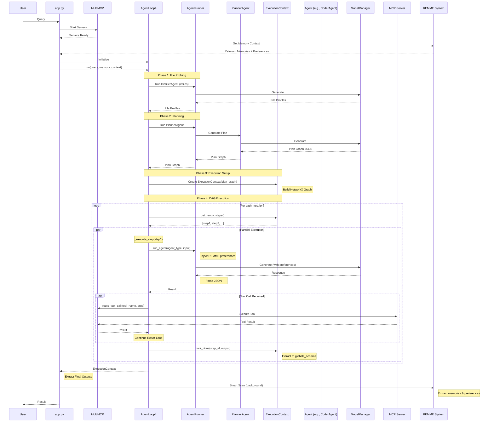

### Variable Flow (globals_schema)

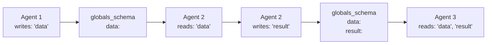

**Key Points**:
- Agents write outputs to `globals_schema` via `writes` keys
- Agents read inputs from `globals_schema` via `reads` keys
- The ExecutionContext automatically extracts outputs after each step
- Multiple extraction strategies ensure robust data flow

---

## Agent System

### Available Agents

| Agent | Purpose | MCP Servers | Model |
|-------|---------|-------------|-------|
| **PlannerAgent** | Generates execution plan DAG | None | Gemini |
| **BrowserAgent** | Web browsing and search | browser | Gemini |
| **CoderAgent** | Python code generation | sandbox, browser, rag | Gemini |
| **RetrieverAgent** | Document/web search | rag, browser | Gemini |
| **SummarizerAgent** | Synthesizes final answers | browser, rag | Gemini |
| **DistillerAgent** | File profiling and summarization | None | Gemini |
| **ThinkerAgent** | Reasoning and logical inference | None | Gemini |
| **FormatterAgent** | Formats final reports | None | Gemini |
| **ClarificationAgent** | User interaction | None | Gemini |
| **QAAgent** | Quality assurance | None | Gemini |

### Agent Execution Pattern

Each agent follows this pattern:

1. **Input Preparation**: AgentRunner builds prompt with:
   - Agent-specific prompt template
   - Available tools (if MCP servers configured)
   - Input data from `globals_schema` (based on `reads`)
   - Session context (query, files, etc.)
   - **REMME preferences** (scope-specific, compact format)
   - **Memory context** (if provided via `memory_context` parameter)

2. **LLM Generation**: ModelManager calls LLM with full prompt

3. **Response Parsing**: JSON parser extracts structured output

4. **Output Processing**:
   - If `call_tool` present: Execute tool, continue ReAct loop
   - If `call_self` present: Recursive execution with updated context
   - Otherwise: Extract outputs to `globals_schema`

### ReAct Loop Details

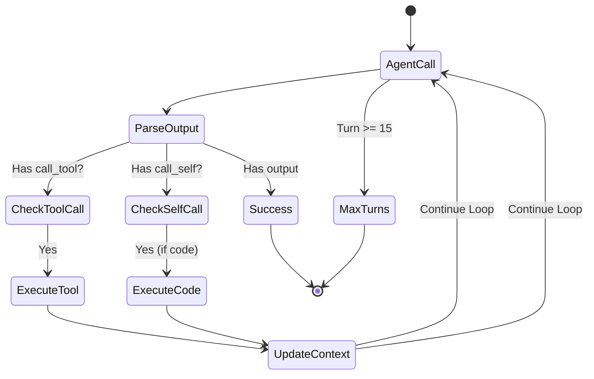

**ReAct Loop Implementation**:
- Maximum 15 turns per agent step
- Tool results are injected as `iteration_context.tool_result`
- Previous output is passed as `previous_output`
- Final turn warning is added to prompt

---

## MCP Integration

### MCP Server Architecture

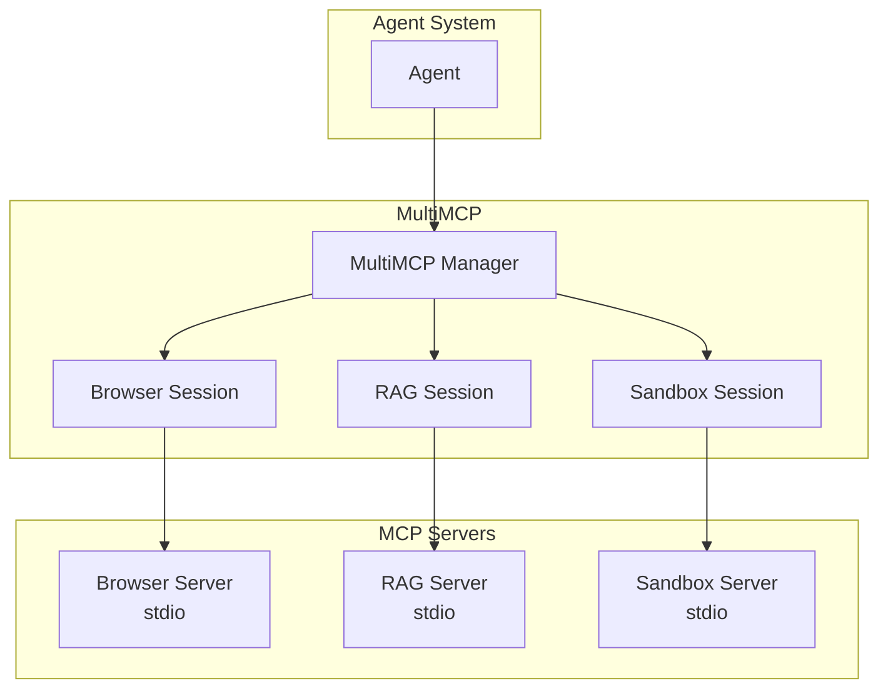

### Tool Discovery

When an agent is configured with MCP servers:
1. AgentRunner calls `multi_mcp.get_tools_from_servers(server_names)`
2. MultiMCP returns flattened list of tools from those servers
3. Tool descriptions are added to the prompt
4. Agent can call tools via `call_tool` in output

### Tool Execution Flow

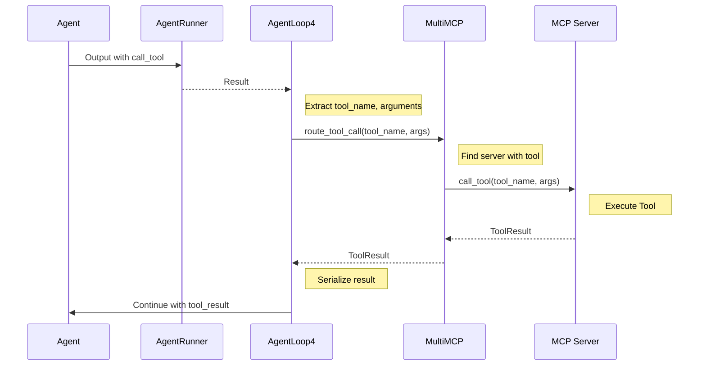

---

## REMME System

**REMME = "Remember Me"** - The single source of truth for user knowledge and preferences.

### Overview

REMME is a centralized memory and preference system that:
1. **Collects** signals from multiple sources (conversations, notes, sessions, news, browser)
2. **Extracts** structured preferences using LLM
3. **Stores** both unstructured memories (for RAG recall) and structured hubs (for agent injection)
4. **Serves** all agents with personalized user context

### Architecture

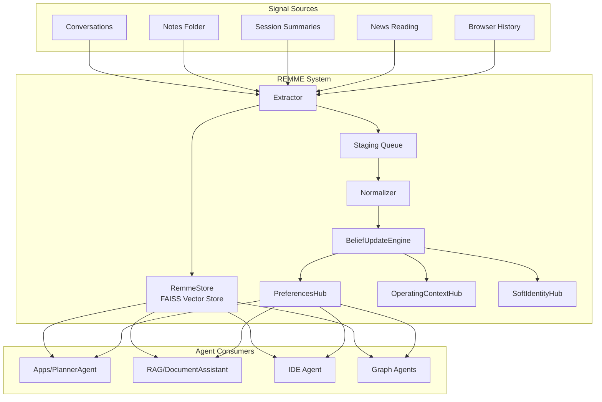

### Two-LLM Pipeline

REMME uses a staged extraction pipeline for robust preference capture:

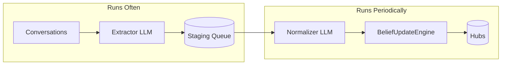

**Stage 1: Extractor (Frequent)**
- **Trigger**: After each conversation scan
- **Output**: Free-form preferences to staging queue
- Uses LLM to extract memories and raw preferences from conversations
- Doesn't need to know hub schema - extracts any preference-like information

**Stage 2: Staging Queue**
- **Location**: `memory/remme_staging.json`
- Stores raw extracted preferences until normalization
- Batches updates for efficiency

**Stage 3: Normalizer (Batched)**
- **Trigger**: Every 10 items OR every 6 hours OR manual "Sync Now"
- Maps extracted fields to known schema fields
- Creates new fields in `extras` for unknown concepts
- Detects conflicts and reinforcements

**Stage 4: BeliefUpdateEngine**
- Calculates confidence updates:
  - **New belief**: Base confidence (0.3)
  - **Reinforcement**: Asymptotic increase (0.3 → 0.45 → 0.55)
  - **Contradiction**: Decrement + conflict resolution
  - **Decay**: Time-based reduction for stale beliefs

**Stage 5: Hubs (Persistence)**
- Final structured storage with confidence scores
- Three hub types: PreferencesHub, OperatingContextHub, SoftIdentityHub

### Core Components

#### 1. RemmeStore (`remme/store.py`)

**Purpose**: FAISS-based vector store for unstructured memory snippets.

**Features**:
- Vector similarity search with keyword boosting
- Deduplication (threshold: 0.15)
- Memory metadata tracking (source, category, timestamps)
- Hybrid search: combines vector similarity with keyword matching

**Storage**:
- `memory/remme_index/index.bin`: FAISS index
- `memory/remme_index/memories.json`: Metadata
- `memory/remme_index/scanned_runs.json`: Session tracking

#### 2. RemmeExtractor (`remme/extractor.py`)

**Purpose**: LLM-based extraction of memories and preferences from conversations.

**Output Format**:
```json
{
  "memories": [
    {"action": "add", "text": "User prefers vegetarian food"}
  ],
  "preferences": {
    "dietary_style": "vegetarian",
    "verbosity": "concise"
  }
}
```

**Integration**:
- Called after session completion via smart scan
- Can be triggered manually via API
- Extracts both facts (memories) and behavioral preferences

#### 3. Preference Hubs (`remme/hubs/`)

**Three Hub Types**:

1. **PreferencesHub**: Output contract, tone, verbosity, autonomy rules
2. **OperatingContextHub**: OS, shell, languages, package managers, location
3. **SoftIdentityHub**: Dietary preferences, hobbies, interests, communication style

**Hub Structure**:
- Pydantic-based schemas for type safety
- Confidence scores per field
- Evidence tracking
- JSON persistence

#### 4. Normalizer (`remme/normalizer.py`)

**Purpose**: Maps free-form extracted preferences to structured hub schema.

**Process**:
1. Reads current hub schema
2. Uses LLM to map extracted fields to known schema fields
3. Creates new fields in `extras` for unknown concepts
4. Detects conflicts and reinforcements
5. Triggers BeliefUpdateEngine for confidence calculation

#### 5. BeliefUpdateEngine (`remme/engines/belief_update.py`)

**Purpose**: Manages confidence scores and evidence tracking.

**Features**:
- Asymptotic confidence increase on reinforcement
- Conflict detection and resolution
- Time-based decay for stale beliefs
- Evidence logging for audit trail

### Signal Sources

**Currently Implemented**:
- ✅ **Conversations** - Via session smart scan (`routers/remme.py`)
- ✅ **Notes** - Scan `data/Notes/*.md` (`remme/sources/notes_scanner.py`)
- ✅ **Session Summaries** - Direct scan of `memory/session_summaries_index` (`remme/sources/session_scanner.py`)

**To Be Implemented**:
- ❌ **News** - Track articles read in NEWS tab
- ❌ **Browser** - External browser history

### Agent Injection

At runtime, agents receive REMME context via `AgentRunner`:

```python
# In agents/base_agent.py
from remme.preferences import get_compact_policy

scope_map = {
    "PlannerAgent": "planning",
    "CoderAgent": "coding",
    "FormatterAgent": "formatting",
    ...
}
scope = scope_map.get(agent_type, "general")
user_prefs_text = f"\n---\n## User Preferences\n{get_compact_policy(scope)}\n---\n"
```

**Memory Context Injection**:
- `AgentLoop4.run()` accepts `memory_context` parameter
- Stored in `ExecutionContext.memory_context`
- Available to all agents via context

**Preference Injection**:
- Compact policy text (< 100 tokens) added to agent prompts
- Scope-specific preferences (coding vs planning vs formatting)
- Tone constraints, verbosity, avoid patterns

### API Endpoints (`routers/remme.py`)

**Memory Management**:
- `GET /remme/memories` - Get all stored memories
- `POST /remme/add` - Manually add memory
- `DELETE /remme/memories/{id}` - Delete memory

**Preference Management**:
- `GET /remme/preferences` - Get all hub preferences
- `POST /remme/preferences/bootstrap` - Bootstrap from existing memories
- `GET /remme/profile` - Generate user profile (cached, weekly refresh)

**Scanning**:
- `POST /remme/scan` - Manual smart scan trigger
- `POST /remme/scan/system` - System-wide scan (notes + sessions)
- `POST /remme/scan/notes` - Scan notes folder only
- `POST /remme/scan/sessions` - Scan session summaries only

**Normalization**:
- `GET /remme/staging/status` - Check staging queue status
- `POST /remme/normalize` - Run normalizer on pending preferences

### Smart Scan Process

**Automatic Background Scan**:
- Triggered on API startup (`api.py` lifespan)
- Scans all unscanned sessions in `memory/session_summaries_index`
- Processes up to 100 sessions per run
- Extracts memories → RemmeStore
- Extracts preferences → Staging queue

**Manual Scan**:
- Via API endpoint or UI button
- Can target specific sources (notes, sessions, system-wide)

---

## Execution Model

### DAG Execution Algorithm

```python
while not context.all_done() and iteration < max_iterations:
    # 1. Get ready steps (dependencies satisfied)
    ready_steps = context.get_ready_steps()
    
    if not ready_steps:
        # Check for failures or wait
        continue
    
    # 2. Mark as running
    for step_id in ready_steps:
        context.mark_running(step_id)
    
    # 3. Execute in parallel
    tasks = [execute_step(step_id, context) for step_id in ready_steps]
    results = await asyncio.gather(*tasks)
    
    # 4. Process results
    for step_id, result in zip(ready_steps, results):
        if result["success"]:
            await context.mark_done(step_id, result["output"])
        else:
            context.mark_failed(step_id, result["error"])
```

### Dependency Resolution

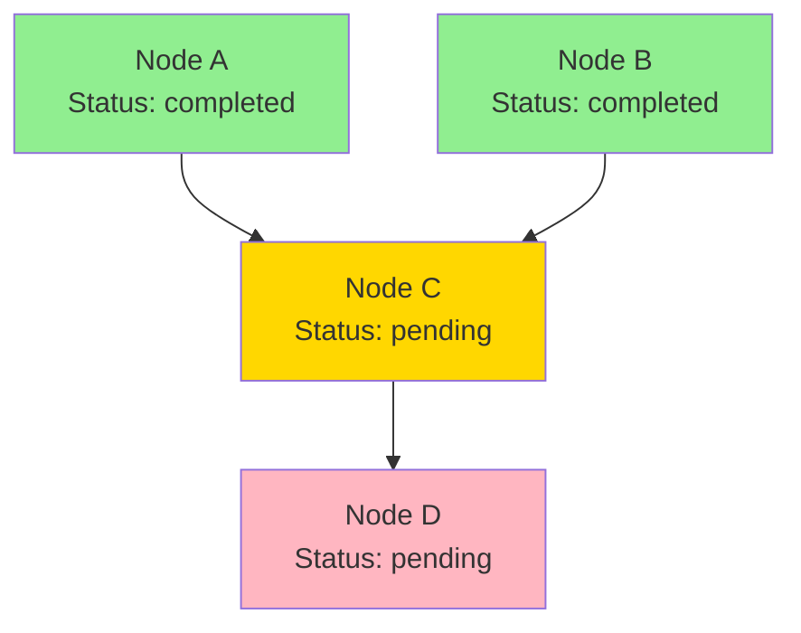

**Rules**:
- A node is "ready" when ALL predecessors have status "completed"
- Multiple nodes can execute in parallel if dependencies allow
- Failed nodes stop execution (unless replanning is implemented)

### Parallel Execution

The system supports true parallel execution:
- Multiple agents can run simultaneously via `asyncio.gather()`
- Each agent step is independent once dependencies are satisfied
- Tool calls within agents are async and non-blocking

---

## Memory & Context Management

### Session Persistence

**Storage Location**: `memory/session_summaries_index/YYYY/MM/DD/session_{session_id}.json`

**Storage Format**: NetworkX `node_link_data` format (JSON)

**Auto-Save**: After each step completion or failure

**Session Data Includes**:
- Complete graph structure (nodes, edges)
- All node attributes (outputs, costs, timing)
- Graph attributes (query, file_manifest, globals_schema)
- Execution history

### Debug Logs

**Location**: `memory/debug_logs/`

**Files**:
- `latest_prompt.txt`: Most recent agent prompt
- `{timestamp}_{agent}_prompt.txt`: Historical prompts
- `{timestamp}_{agent}_response.txt`: Historical responses

### Context Graph Structure

```python
plan_graph = nx.DiGraph()

# Graph-level attributes
plan_graph.graph = {
    'session_id': '12345678',
    'original_query': 'User query',
    'file_manifest': [...],
    'created_at': '2025-01-15T10:30:00',
    'status': 'running',
    'globals_schema': {
        'data': {...},
        'result': {...}
    }
}

# Node attributes
plan_graph.nodes['step1'] = {
    'agent': 'PlannerAgent',
    'status': 'completed',
    'reads': [],
    'writes': ['plan_graph'],
    'output': {...},
    'cost': 0.001,
    ...
}
```

---

## API Layer

### FastAPI Server (`api.py`)

**Purpose**: RESTful API server for external integrations and frontend access.

**Key Features**:
- FastAPI-based REST endpoints
- CORS middleware for frontend access
- Background task support
- Lifespan management for MCP servers and REMME smart scan

**Lifespan Events**:
```python
@asynccontextmanager
async def lifespan(app: FastAPI):
    # Startup
    await multi_mcp.start()
    asyncio.create_task(background_smart_scan())
    yield
    # Shutdown
    await multi_mcp.stop()
```

### API Routers

**Core Routers**:
- `routers/runs.py` - Session execution and management
- `routers/remme.py` - Memory and preference management
- `routers/metrics.py` - Analytics and dashboard metrics
- `routers/settings.py` - Configuration management
- `routers/apps.py` - Application-level operations
- `routers/chat.py` - Chat interface endpoints
- `routers/agent.py` - Agent-specific operations
- `routers/ide_agent.py` - IDE agent integration

**Specialized Routers**:
- `routers/rag.py` - RAG server operations
- `routers/explorer.py` - File system exploration
- `routers/mcp.py` - MCP server management
- `routers/prompts.py` - Prompt management
- `routers/news.py` - News reading integration
- `routers/git.py` - Git operations

### Shared State (`shared/state.py`)

**Purpose**: Centralized singleton instances for cross-module access.

**Managed Instances**:
- `multi_mcp` - MultiMCP manager
- `remme_store` - RemmeStore instance
- `remme_extractor` - RemmeExtractor instance
- `active_loops` - Dictionary of active AgentLoop4 instances

**Benefits**:
- Single source of truth for shared resources
- Prevents duplicate initialization
- Enables cross-router communication

### API Endpoints Overview

**Health & Status**:
- `GET /health` - Server health check

**Session Management** (`/runs`):
- `POST /runs/execute` - Execute a new query
- `GET /runs/{session_id}` - Get session details
- `GET /runs/{session_id}/graph` - Get execution graph (ReactFlow format)

**REMME** (`/remme`):
- `GET /remme/memories` - List all memories
- `POST /remme/add` - Add memory manually
- `GET /remme/preferences` - Get all preferences
- `POST /remme/scan` - Trigger smart scan
- `POST /remme/normalize` - Run normalizer

**Metrics** (`/metrics`):
- `GET /metrics/dashboard` - Get dashboard metrics
- `POST /metrics/refresh` - Force metrics refresh

---

## Metrics & Analytics

### Metrics Aggregator (`core/metrics_aggregator.py`)

**Purpose**: Fleet-level telemetry and analytics across all sessions.

**Features**:
- Aggregates data from `data/conversation_history/`
- Caches results for performance
- Provides dashboard-ready metrics

### Metrics Categories

**1. Fleet Overview**:
- Total runs, success rate, average cost
- Total tokens (input/output)
- Average execution time
- Cost trends

**2. Agent Performance**:
- Per-agent invocation counts
- Success rates by agent
- Average cost per agent
- Token usage by agent

**3. Daily Trends**:
- Runs per day (last 30 days)
- Cost per day
- Success rate trends
- Agent usage patterns

**4. Cost Analysis**:
- Total cost breakdown
- Cost per run
- Cost by agent
- Cost efficiency metrics

**5. Execution Patterns**:
- Most common agent sequences
- Average DAG depth
- Parallel execution efficiency
- Failure patterns

### Caching Strategy

**Cache Location**: `memory/metrics/dashboard_cache.json`

**Refresh Triggers**:
- Manual refresh via API endpoint
- Automatic refresh on data changes (if implemented)
- Cache invalidation after session completion

### API Integration

**Endpoint**: `GET /metrics/dashboard`

**Response Format**:
```json
{
  "totals": {
    "runs": 400,
    "success_rate": 0.85,
    "total_cost": 12.50,
    "avg_cost_per_run": 0.031
  },
  "by_agent": {
    "PlannerAgent": {"count": 400, "success_rate": 0.98, "avg_cost": 0.002},
    "CoderAgent": {"count": 250, "success_rate": 0.90, "avg_cost": 0.015}
  },
  "by_day": [
    {"date": "2026-01-15", "runs": 15, "cost": 0.45, "success_rate": 0.87}
  ]
}
```

---

## UI & Visualization

### Execution Visualizer (`ui/visualizer.py`)

**Purpose**: Real-time visualization of DAG execution state.

**Features**:
- Tree view of execution DAG
- Status indicators (pending, running, completed, failed)
- Execution log panel
- Convergence node handling (multiple parents)

**Visualization Layout**:
```
┌─────────────────────────────────────┐
│   Agent Execution DAG               │
│                                     │
│   ROOT ✅ Initial Query             │
│   ├── step1 ✅ PlannerAgent         │
│   │   ├── step2 ✅ RetrieverAgent   │
│   │   └── step3 🔄 CoderAgent       │
│   └── step4 ⏳ SummarizerAgent      │
└─────────────────────────────────────┘
┌─────────────────────────────────────┐
│   Execution Log                     │
│   [10:30:15] 🔄 Starting step3...  │
│   [10:30:20] ✅ Completed step2     │
└─────────────────────────────────────┘
```

### Web UI (Gradio)

**Features**:
- Chat interface
- Real-time log streaming
- Execution summary display
- Non-blocking async execution

**Implementation**:
- Uses Gradio's `ChatInterface`
- Monkey-patches logging to capture logs
- Streams logs while execution runs
- Displays final result with execution logs

---

## Low-Level Implementation Details

### JSON Parsing (`core/json_parser.py`)

**Purpose**: Robustly parse JSON from LLM outputs (which may be malformed).

**Strategies**:
1. **Fenced JSON**: Extract from ` ```json ... ``` ` blocks
2. **Balanced Braces**: Find largest balanced `{...}` block
3. **Auto-Repair**: Use `json_repair` library to fix common issues

**Error Handling**:
- Raises `JsonParsingError` if all strategies fail
- Supports required key validation

### Code Execution (`tools/sandbox.py`)

**Purpose**: Execute Python code generated by agents safely.

**Features**:
- Variable injection from `globals_schema`
- MCP tool access within code
- Error handling and result capture
- Execution time tracking

**Variable Injection**:
```python
# Injected automatically:
globals_schema variables → global variables
reads_data → convenience dict
agent output variables → global variables
```

### Cost Calculation

**Formula**:
```
input_tokens = words * 1.5
output_tokens = words * 1.5
input_cost = (input_tokens / 1_000_000) * $0.1
output_cost = (output_tokens / 1_000_000) * $0.4
total_cost = input_cost + output_cost
```

**Tracking**:
- Per-agent cost tracking
- Session-level cost aggregation
- Cost breakdown in execution summary

### Error Handling

**Failure Modes**:
1. **Agent Failure**: Step marked as "failed", execution continues if possible
2. **Tool Failure**: Error fed back to agent for retry
3. **JSON Parse Failure**: Raises exception, step fails
4. **Code Execution Failure**: Tries next code variant if available

**Recovery**:
- Mid-session replanning (TODO: not yet implemented)
- Tool retry via ReAct loop
- Code variant fallback

---

## Configuration Files

### `config/agent_config.yaml`
Defines all agents, their prompts, models, and tool access.

### `config/mcp_server_config.yaml`
Defines MCP server configurations (currently legacy, servers are hardcoded in `multi_mcp.py`).

### `config/models.json`
Defines LLM model configurations (API keys, endpoints, types).

### `config/profiles.yaml`
Defines default model profiles and settings.

---

## Extension Points

### Adding a New Agent

1. Create prompt file in `prompts/new_agent.md`
2. Add agent config to `config/agent_config.yaml`:
   ```yaml
   NewAgent:
     prompt_file: "16_NetworkX/prompts/new_agent.md"
     model: "gemini"
     mcp_servers: ["browser"]  # Optional
     description: "Agent description"
   ```
3. Agent is automatically available to PlannerAgent
4. **REMME Integration**: Agent will automatically receive user preferences via `get_compact_policy(scope)` in `AgentRunner`

### Adding a New MCP Server

1. Create server script in `mcp_servers/server_new.py`
2. Add to `MultiMCP.server_configs`:
   ```python
   "new_server": {
       "command": "uv",
       "args": ["run", "16_NetworkX/mcp_servers/server_new.py"],
   }
   ```
3. Reference in agent configs via `mcp_servers: ["new_server"]`

### Adding a New LLM Provider

1. Add model config to `config/models.json`
2. Implement generation method in `ModelManager`:
   ```python
   async def _new_provider_generate(self, prompt: str) -> str:
       # Implementation
   ```
3. Add case in `generate_text()` method

### Adding a New REMME Signal Source

1. Create scanner in `remme/sources/new_scanner.py`:
   ```python
   async def scan_new_source() -> int:
       # Scan source, extract preferences
       # Add to staging queue via get_staging_store()
       return count
   ```
2. Add endpoint in `routers/remme.py`:
   ```python
   @router.post("/scan/new_source")
   async def run_new_source_scan():
       count = await scan_new_source()
       return {"status": "success", "count": count}
   ```
3. Integrate into system scan if needed

### Adding a New Preference Hub

1. Create hub class in `remme/hubs/new_hub.py` extending `BaseHub`
2. Define schema in `remme/schemas/hub_schemas.py`
3. Add to `remme/hubs/__init__.py` exports
4. Update `remme/extractor.py` to map extracted fields to new hub
5. Add API endpoints in `routers/remme.py` if needed

---

## Performance Considerations

### Parallelization
- Agents execute in parallel when dependencies allow
- Tool calls are async and non-blocking
- MCP servers run in separate processes

### Rate Limiting
- Gemini API: ~15 RPM (4.5s minimum interval)
- Enforced via asyncio locks
- Prevents API quota exhaustion

### Memory Management
- NetworkX graphs are memory-efficient for DAGs
- Session data persisted to disk after each step
- Debug logs can be cleaned periodically

### Scalability
- Graph-based execution scales to large DAGs
- Parallel execution improves throughput
- MCP servers can be distributed

---

## Future Enhancements

1. **Mid-Session Replanning**: Implement `_handle_failures()` for dynamic replanning
2. **Agent Memory**: Long-term memory for agents across sessions (partially implemented via REMME)
3. **Streaming Responses**: Real-time streaming of agent outputs
4. **Distributed Execution**: Execute agents across multiple machines
5. **Advanced Visualization**: Interactive graph visualization in web UI
6. **Cost Optimization**: Agent selection based on cost/performance tradeoffs
7. **REMME Enhancements**:
   - News reading integration for preference extraction
   - Browser history integration
   - Cross-session memory retrieval in agent prompts
   - Preference-based agent selection
   - Confidence-based preference application
8. **Metrics Dashboard**: Real-time dashboard UI for metrics aggregator
9. **API Authentication**: Add authentication/authorization for API endpoints
10. **REMME UI**: Frontend interface for managing memories and preferences

---

## Conclusion

The S16 NetworkX Agent System provides a robust, scalable framework for multi-agent orchestration. Its graph-based architecture enables complex workflows while maintaining clarity and debuggability. The modular design allows easy extension with new agents, tools, and LLM providers.

**Key Innovations**:
- **Graph-First Execution**: NetworkX DAGs as the single source of truth for execution state
- **REMME Integration**: Centralized user memory and preference system that personalizes agent behavior
- **Two-LLM Pipeline**: Robust preference extraction via extractor + normalizer stages
- **API-First Design**: FastAPI server enables external integrations and frontend development
- **Fleet Analytics**: Metrics aggregator provides observatory-level insights across all sessions

The system continues to evolve with REMME providing the foundation for personalized, context-aware agent interactions, while the API layer enables broader ecosystem integration.

